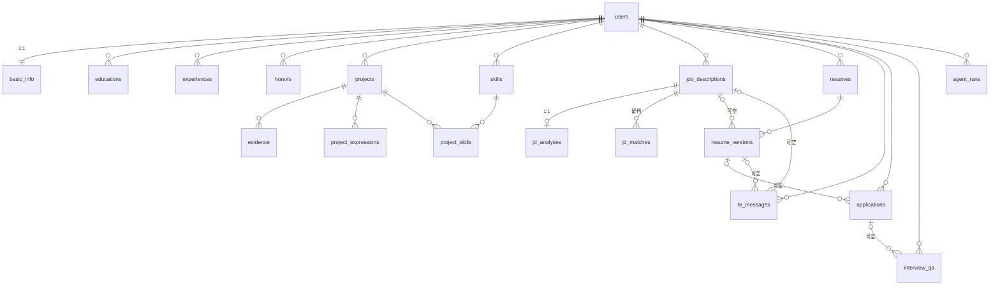

# 02 数据模型设计（Data Model）

> 项目：AI Job Copilot
> 依据：PRD.md v0.4（2026-09-04）· 01-feature-design.md v0.4（已确认）· 04-api-design.md v0.3（已确认）
> 版本：v0.4
> 状态：已确认
> 更新：2026-09-07
> 技术前提：PostgreSQL（Docker 起库，01 决定 #6）；LLM 结构化输出一律以 JSONB 落库；建表 DDL 于实现阶段按本文档生成（建议 SQLAlchemy 2.0 + Alembic）

## 修订记录

| 版本 | 日期 | 变更 |
|---|---|---|
| v0.1 | 2026-09-04 | 初稿：19 张表、枚举定义、关键 JSON 结构、ER 图、索引与删除策略、关键设计决策 |
| v0.2 | 2026-09-04 | 确认三项待定：单用户模式；项目表达保留历史（1:N）；JD 匹配每次留档（1:N） |
| v0.3 | 2026-09-04 | resume_versions 定稿模型（04-api-design 决策 #1）：pending 状态内容可编辑（新增 updated_at），confirm 定稿锁定（新增 confirmed_at）；修正 §1 快照原则表述 |
| v0.4 | 2026-09-07 | agent_runs 补 feedback 列（03 §4.1 👍/👎，05 待确认 #4 采纳：前端已实现，契约以后端补齐为准）；对应已建库一次性演进 SQL `docker/alter/2026-09-07_agent_runs_feedback.sql` |

## 1. 设计原则

1. **精简**：MVP 共 19 张表，LLM 半结构化输出用 JSONB 收敛（不为一堆文本字段建列/建表）。
2. **快照优先**：简历版本存「生成时的完整内容快照」，不引用资产表——已生成/已投递的简历不随资产库变动，投递数据可追溯（为 Resume A/B Testing 留基础，F7.3）。版本 **confirm 定稿后锁定**（§4.15），投递只能引用定稿版，快照语义自此生效。
3. **程序负责确定性**（PRD §3.3）：Dashboard 统计、回复率、MD 渲染均为派生计算，不落库、不让 LLM 估算。
4. **冗余最小、按需冗余**：仅 Interview QA 冗余公司/岗位两列（按公司分组查询需要，见决策 #11）。
5. **可演进**：枚举用 TEXT + CHECK（不用 PG 原生 ENUM，迁移成本低）；JSON 内容带 `schema_version`。

## 2. 实体总览（按模块）

```text
┌── M1 Career Assets ────────────────────────────────────────────┐
│ basic_info (1:1 users，含求职意向 / 自我评价)                    │
│ educations · experiences(科研/校园) · honors                   │
│ projects ──┬── evidence                                        │
│            ├── project_skills ── skills                        │
│            └── project_expressions（M3 产物，挂在项目上，留档）   │
├── M2 JD Analysis ──────────────────────────────────────────────┤
│ job_descriptions ── jd_analyses (1:1)                          │
│ job_descriptions ── jd_matches   (1:N，每次匹配留档)             │
├── M4 Resume Agent / M5 Resume Studio ──────────────────────────┤
│ resumes（按目标岗位分类）── resume_versions（内容快照 + Reflection）│
├── M6 / M7 / M8 ────────────────────────────────────────────────┤
│ hr_messages                                                    │
│ applications ── interview_qa（可选关联）                        │
├── 横切 ─────────────────────────────────────────────────────────┤
│ agent_runs（Agent 执行日志）                                    │
└────────────────────────────────────────────────────────────────┘
```

## 3. ER 图

```text
User(用户) 1──┬──1 BasicInfo（基本信息）
             ├──N Education（教育）
             ├──N Experience（经历）
             ├──N Honor（荣誉）
             ├──N Project（项目）
             │       ├─N Evidence（证据）
             │       ├─N ProjectExpression（项目表达）
             │       └─M ProjectSkill ─N Skill（技能）  ←多对多
             ├──N Skill（技能）
             ├──N JobDescription(JD)
             │       ├─1 JDAnalysis(JD分析)
             │       └─N JDMatch(匹配记录)
             ├──N Resume(简历)
             │       └─N ResumeVersion(简历版本)
             ├──N HrMessage(HR消息)
             ├──N Application投递记录
             │       └─N InterviewQA面试问答
             └──N AgentRun agent运行日志
```



## 4. 表结构明细

通用约定：主键 `id UUID PRIMARY KEY DEFAULT gen_random_uuid()`；所有表含 `created_at TIMESTAMPTZ NOT NULL DEFAULT now()`，可变数据表含 `updated_at TIMESTAMPTZ NOT NULL DEFAULT now()`（ORIG/DB 触发器自动维护）。

### 4.1 users — 用户

| 字段 | 类型 | 约束 | 说明 |
|---|---|---|---|
| id | UUID | PK | |
| email | TEXT | UNIQUE | 登录标识；单用户模式下占位（已确认单用户，见 §11） |
| created_at / updated_at | TIMESTAMPTZ | NOT NULL | |

### 4.2 basic_info — 基本信息与求职意向（1:1）

| 字段 | 类型 | 约束 | 说明 |
|---|---|---|---|
| id | UUID | PK | |
| user_id | UUID | FK→users, UNIQUE, NOT NULL | |
| name | TEXT | NOT NULL | 姓名 |
| email | TEXT | NOT NULL | 简历展示邮箱（可与登录邮箱不同） |
| phone | TEXT | NOT NULL | |
| github_url | TEXT | NOT NULL | |
| homepage_url | TEXT | NULL | 个人主页（可选） |
| job_role | TEXT | NULL | 意向岗位（F1.1，参与 JD Match 提示） |
| city | TEXT | NULL | 意向城市 |
| availability | availability | NULL | 到岗时间枚举 |
| self_evaluation | TEXT | NULL | 自我评价（F1.8，简历第 8 段来源） |

### 4.3 educations — 教育背景（F1.5，可多条）

| 字段 | 类型 | 约束 | 说明 |
|---|---|---|---|
| id | UUID | PK | |
| user_id | UUID | FK→users, NOT NULL | |
| school | TEXT | NOT NULL | 学校 |
| major | TEXT | NOT NULL | 专业 |
| degree | degree | NOT NULL | 阶段（本科/硕士/博士） |
| start_date | DATE | NULL | |
| end_date | DATE | NULL | 在读可空 |
| courses | TEXT | NULL | 主修课程（可选补充） |
| sort_order | INT | NOT NULL DEFAULT 0 | 简历展示顺序 |

### 4.4 experiences — 科研 / 校园经历（F1.6，可选，合并一张表）

| 字段 | 类型 | 约束 | 说明 |
|---|---|---|---|
| id | UUID | PK | |
| user_id | UUID | FK→users, NOT NULL | |
| type | experience_type | NOT NULL | research / campus |
| name | TEXT | NOT NULL | 经历名称 |
| role | TEXT | NULL | 角色 |
| start_date / end_date | DATE | NULL | |
| description | TEXT | NULL | 描述 |
| sort_order | INT | NOT NULL DEFAULT 0 | |

### 4.5 projects — 项目资产（核心数据源）

| 字段 | 类型 | 约束 | 说明 |
|---|---|---|---|
| id | UUID | PK | |
| user_id | UUID | FK→users, NOT NULL | |
| name | TEXT | NOT NULL | 项目名称 |
| summary | TEXT | NULL | 项目简介 |
| background | TEXT | NULL | 项目背景 |
| goal | TEXT | NULL | 项目目标 |
| start_date / end_date | DATE | NULL | 项目时间 |
| role | TEXT | NULL | 项目角色 |
| tech_stack | TEXT[] | NOT NULL DEFAULT '{}' | 技术栈（展示用） |
| responsibilities | TEXT | NULL | 个人职责 |
| core_work | TEXT | NULL | 核心工作 |
| difficulties | TEXT | NULL | 技术难点 |
| solutions | TEXT | NULL | 解决方案 |
| results | TEXT | NULL | 项目成果 |
| github_url | TEXT | NULL | |
| demo_url | TEXT | NULL | |
| sort_order | INT | NOT NULL DEFAULT 0 | |

> 说明：上表字段即「通用版表达」的载体——AI 辅助填写（F1.2.3）提炼回填、用户确认后写入，供 Project Agent / Resume Agent 读取。通用版不单独建表（决策 #3）。

### 4.6 skills — 技能

| 字段 | 类型 | 约束 | 说明 |
|---|---|---|---|
| id | UUID | PK | |
| user_id | UUID | FK→users, NOT NULL | |
| name | TEXT | NOT NULL | 技能名称 |
| proficiency | proficiency | NOT NULL | 熟练程度 |
| sort_order | INT | NOT NULL DEFAULT 0 | |
| — | — | UNIQUE(user_id, name) | |

### 4.7 project_skills — 技能-项目关联（PRD §6.4）

| 字段 | 类型 | 约束 | 说明 |
|---|---|---|---|
| project_id | UUID | FK→projects ON DELETE CASCADE | 联合主键 |
| skill_id | UUID | FK→skills ON DELETE CASCADE | 联合主键 |

### 4.8 evidence — 证据（PRD §3.1 Evidence First）

| 字段 | 类型 | 约束 | 说明 |
|---|---|---|---|
| id | UUID | PK | |
| project_id | UUID | FK→projects ON DELETE CASCADE, NOT NULL | |
| type | evidence_type | NOT NULL | 证据类型 |
| title | TEXT | NOT NULL | 展示名（如「GitHub 仓库」） |
| url | TEXT | NULL | |
| note | TEXT | NULL | |

### 4.9 honors — 荣誉证书（F1.7，可选）

| 字段 | 类型 | 约束 | 说明 |
|---|---|---|---|
| id | UUID | PK | |
| user_id | UUID | FK→users, NOT NULL | |
| name | TEXT | NOT NULL | 证书/荣誉名称 |
| time | TEXT | NULL | 自由时间串（如「2026 年 6 月」，MVP 不做日期结构化） |
| sort_order | INT | NOT NULL DEFAULT 0 | |

### 4.10 project_expressions — Project Agent 求职场景表达（M3 / F3.2，保留历史）

| 字段 | 类型 | 约束 | 说明 |
|---|---|---|---|
| id | UUID | PK | |
| project_id | UUID | FK→projects ON DELETE CASCADE, NOT NULL | |
| type | expression_type | NOT NULL | resume_bullet / interview / star |
| version_number | INT | NOT NULL | 该 (project, type) 组合下递增 1, 2, 3… |
| content | JSONB | NOT NULL | 见 §6.3 |
| status | expression_status | NOT NULL DEFAULT 'draft' | Human-in-the-loop：用户确认后置 confirmed |
| created_at / updated_at | TIMESTAMPTZ | NOT NULL | |
| — | — | UNIQUE(project_id, type, version_number) | 保留历史；当前版本 = 该组合下 version_number 最大者 |

> 取用规则：Resume Agent 优先取该 (project, type) 组合下**最新的 confirmed** 版本；无 confirmed 时取最新草稿。

### 4.11 job_descriptions — JD（F2.1，仅粘贴文本）

| 字段 | 类型 | 约束 | 说明 |
|---|---|---|---|
| id | UUID | PK | |
| user_id | UUID | FK→users, NOT NULL | |
| title | TEXT | NULL | 用户命名（缺省取分析结果岗位名） |
| company | TEXT | NULL | 可选，投递时引用 |
| raw_text | TEXT | NOT NULL | JD 原文 |

### 4.12 jd_analyses — JD 分析结果（F2.2，1:1）

| 字段 | 类型 | 约束 | 说明 |
|---|---|---|---|
| id | UUID | PK | |
| jd_id | UUID | FK→job_descriptions ON DELETE CASCADE, UNIQUE, NOT NULL | |
| status | analysis_status | NOT NULL DEFAULT 'processing' | 异步分析状态 |
| title | TEXT | NULL | 岗位名称识别 |
| core_skills | JSONB | NULL | 核心技能含星级，见 §6.2 |
| plus_skills | JSONB | NULL | 加分项 |
| responsibilities | JSONB | NULL | 岗位职责 text[] |
| experience_requirement | TEXT | NULL | 经验要求 |
| education_requirement | TEXT | NULL | 学历要求 |
| keywords | JSONB | NULL | 关键词 text[] |
| error | TEXT | NULL | 失败原因 |

### 4.13 jd_matches — 岗位匹配结果（F2.3 / F2.4，每次匹配留档）

| 字段 | 类型 | 约束 | 说明 |
|---|---|---|---|
| id | UUID | PK | |
| jd_id | UUID | FK→job_descriptions ON DELETE CASCADE, NOT NULL | 一次匹配一条记录 |
| overall_score | NUMERIC(5,2) | NULL | 总体匹配度（如 87） |
| skill_matches | JSONB | NULL | 三类清单，见 §6.4 |
| matched_project_ids | JSONB | NULL | 相关项目 UUID[] |
| advantages | JSONB | NULL | 你的优势 text[] |
| gaps | JSONB | NULL | 你的不足 text[] |
| created_at / updated_at | TIMESTAMPTZ | NOT NULL | |

> 最新结果 = 该 jd_id 下 created_at 最大者；历史留档支撑「资产增长 → 匹配度变化」的观察（呼应 PRD §17 Career Analytics）。

### 4.14 resumes — 简历（按目标岗位分类，F4.2 / F5.1）

| 字段 | 类型 | 约束 | 说明 |
|---|---|---|---|
| id | UUID | PK | |
| user_id | UUID | FK→users, NOT NULL | |
| title | TEXT | NOT NULL | 显示名 |
| target_role | TEXT | NOT NULL | 目标岗位分类（分组键，如「AI 应用工程师」） |
| template | template | NULL | 选定模板后非空（F5.3） |
| — | — | UNIQUE(user_id, target_role) | 同一岗位一份简历，版本在 resume_versions |

### 4.15 resume_versions — 简历版本（F4.2 / F4.5，内容快照）

| 字段 | 类型 | 约束 | 说明 |
|---|---|---|---|
| id | UUID | PK | |
| resume_id | UUID | FK→resumes ON DELETE CASCADE, NOT NULL | |
| version_number | INT | NOT NULL | 递增 1, 2, 3…（展示为 v1 / v2） |
| jd_id | UUID | FK→job_descriptions ON DELETE SET NULL, NULL | 定制依据；Master 版为空 |
| content | JSONB | NOT NULL | 8 段完整内容快照，见 §6.1 |
| reflection_status | reflection_status | NOT NULL DEFAULT 'pending' | Reflection 验证状态 |
| reflection_result | JSONB | NULL | 匹配度 + 编造检查，见 §6.5 |
| created_at | TIMESTAMPTZ | NOT NULL DEFAULT now() | |
| updated_at | TIMESTAMPTZ | NOT NULL DEFAULT now() | pending 期内容编辑时更新；定稿后不再变化 |
| confirmed_at | TIMESTAMPTZ | NULL | 定稿时间；**非空即锁定**（content 拒绝写入，API 409 locked_version） |
| — | — | UNIQUE(resume_id, version_number) | |

> 生命周期（04-api-design §5.4，v0.3 修订）：`pending`（可编辑，快照语义未生效）→ reflect 后 `passed / issues` → **confirm 定稿**（confirmed_at 落时间，content 锁定不可变）。投递仅引用定稿版，快照语义自此生效；未定稿版本可重新生成（regenerate 产生 v+1，本版本不动）。

### 4.16 hr_messages — HR 开场白（F6，生成后可编辑保存）

| 字段 | 类型 | 约束 | 说明 |
|---|---|---|---|
| id | UUID | PK | |
| user_id | UUID | FK→users, NOT NULL | |
| jd_id | UUID | FK→job_descriptions ON DELETE SET NULL, NULL | 依据 JD |
| resume_version_id | UUID | FK→resume_versions ON DELETE SET NULL, NULL | |
| scene | hr_scene | NOT NULL | Boss直聘/微信/邮件/LinkedIn |
| mode | hr_mode | NOT NULL | 简短版/标准版/技术版 |
| content | TEXT | NOT NULL | 文案正文 |

### 4.17 applications — 投递记录（F7，极简表格）

| 字段 | 类型 | 约束 | 说明 |
|---|---|---|---|
| id | UUID | PK | |
| user_id | UUID | FK→users, NOT NULL | |
| company | TEXT | NOT NULL | 公司 |
| position | TEXT | NOT NULL | 岗位 |
| status | application_status | NOT NULL DEFAULT 'to_apply' | 状态流转 |
| applied_at | DATE | NULL | 投递时间（待投递为空） |
| resume_version_id | UUID | FK→resume_versions ON DELETE SET NULL, NULL | 使用的简历版本（F7.3，A/B 测试基础） |
| note | TEXT | NULL | 备注 |

### 4.18 interview_qa — 面试问题记录（M8 / F8）

| 字段 | 类型 | 约束 | 说明 |
|---|---|---|---|
| id | UUID | PK | |
| user_id | UUID | FK→users, NOT NULL | |
| application_id | UUID | FK→applications ON DELETE SET NULL, NULL | 关联投递（F8.3），自动带出岗位 |
| company | TEXT | NOT NULL | 冗余自投递记录，支持按公司分组 |
| position | TEXT | NULL | 冗余，关联时自动带出 |
| interview_at | DATE | NULL | 面试时间 |
| question | TEXT | NOT NULL | 问题 |
| answer | TEXT | NULL | 我的回答 |
| note | TEXT | NULL | 复盘备注 |

### 4.19 agent_runs — Agent 执行日志（横切，可观测性）

| 字段 | 类型 | 约束 | 说明 |
|---|---|---|---|
| id | UUID | PK | |
| user_id | UUID | FK→users, NOT NULL | |
| agent_type | TEXT | NOT NULL | jd_agent / project_agent / resume_agent / hr_agent / asset_assist |
| prompt_name | TEXT | NULL | backend/prompts/ 下模板名（01 决定 #9） |
| model | TEXT | NULL | 所用模型 |
| status | agent_run_status | NOT NULL DEFAULT 'running' | |
| input_refs | JSONB | NULL | {jd_id, project_id, resume_version_id, …} |
| output_refs | JSONB | NULL | 产出的实体引用 |
| error | TEXT | NULL | |
| feedback | TEXT | NULL | 👍/👎 反馈（03 §4.1），up / down；可覆盖（同一 run 最新一次为准）。v0.4 补列 |
| latency_ms | INT | NULL | |
| input_tokens / output_tokens | INT | NULL | |
| created_at | TIMESTAMPTZ | NOT NULL DEFAULT now() | |
| finished_at | TIMESTAMPTZ | NULL | |

## 5. 枚举定义

| 枚举 | 值 | 中文 | 来源 |
|---|---|---|---|
| availability | immediate / within_1_week / within_2_weeks / within_1_month / undecided | 立即到岗/一周内/两周内/一个月内/待定 | PRD §6.5 |
| degree | bachelor / master / phd | 本科/硕士/博士 | F1.5 |
| experience_type | research / campus | 科研/校园 | F1.6 |
| proficiency | beginner / familiar / proficient / expert | 了解/熟悉/熟练/精通 | F1.4 |
| evidence_type | github / code / doc / experiment / screenshot / demo / paper / other | GitHub/代码/项目文档/实验结果/项目截图/Demo/论文/其他 | PRD §3.1 |
| expression_type | resume_bullet / interview / star | 简历版/面试版/STAR 版 | F3.2 |
| expression_status | draft / confirmed | 草稿/已确认 | F3.2 |
| analysis_status | processing / completed / failed | | F2.2 |
| skill_match_status | strong / partial / missing | 强匹配/部分匹配/缺失 | PRD §7.4 |
| template | classic / modern / minimal | | F5.3 |
| reflection_status | pending / passed / issues | 未验证/通过/存在问题 | F4.5 |
| hr_scene | boss_zhipin / wechat / email / linkedin | Boss直聘/微信/邮件/LinkedIn | F6.1 |
| hr_mode | short / standard / technical | 简短版/标准版/技术版 | F6.2 |
| application_status | to_apply / applied / replied / interview / offer / rejected / no_response | 待投递/已投递/已回复/面试/Offer/拒绝/无回复 | PRD §12.3 |
| agent_run_status | running / completed / failed | | |

实现方式：**TEXT + CHECK 约束**（SQLAlchemy Enum 默认行为），不用 PG 原生 ENUM 类型，避免后续加值时的迁移成本（决策 #10）。

## 6. 关键 JSON 结构

约定：所有 JSONB 内容带 `schema_version` 字段，便于后续结构演进。

### 6.1 resume_versions.content — 简历 8 段内容快照

```json
{
  "schema_version": 1,
  "basic_info": {
    "name": "张三", "email": "a@b.com", "phone": "138****", 
    "github": "https://github.com/xxx", "homepage": null
  },
  "job_intention": {"role": "AI 应用工程师", "city": "上海", "availability": "within_1_week"},
  "education": [
    {"school": "XX 大学", "major": "计算机科学与技术", "degree": "master",
     "period": "2023.09 - 2026.06", "courses": "机器学习、NLP"}
  ],
  "research": [],
  "campus": [],
  "projects": [
    {
      "name": "Review-Agent", "period": "2025.03 - 2025.08", "role": "核心开发",
      "tech_stack": ["LangGraph", "RAG", "FastAPI"],
      "bullets": ["基于 LangGraph 构建 RAG Agent Workflow，完成知识库检索、重排与生成流程的模块化编排。"],
      "github": "https://github.com/xxx", "demo": null
    }
  ],
  "honors": [{"name": "优秀毕业生", "time": "2026 年 6 月"}],
  "skills": [{"name": "Python", "proficiency": "expert"}],
  "self_evaluation": "…"
}
```

- 与 PRD §11.5 的 8 段一一对应；`job_intention` 为附加头部信息，模板可选用渲染。
- **快照语义**（决策 #1）：生成时从资产库取值固化，之后资产库任何变动不影响本版本；可选模块为空数组时模板自动隐藏该段落（F5.3）。
- `period` 由 start_date/end_date 在生成时格式化，快照内为纯文本。

### 6.2 jd_analyses — 岗位画像

```json
{
  "title": "AI 应用工程师",
  "core_skills": [{"name": "Python", "stars": 5}, {"name": "RAG", "stars": 5}],
  "plus_skills": [{"name": "Docker", "stars": 3}],
  "responsibilities": ["Agent 应用开发", "RAG 系统开发"],
  "experience_requirement": "3-5 年",
  "education_requirement": "本科及以上",
  "keywords": ["Agent", "RAG", "LangGraph"]
}
```

### 6.3 project_expressions.content — 三种求职场景表达

```jsonc
// resume_bullet（1~3 条）
{"bullets": ["…", "…"]}

// interview
{"background": "…", "responsibility": "…", "architecture": "…",
 "difficulty": "…", "solution": "…", "result": "…"}

// star
{"situation": "…", "task": "…", "action": "…", "result": "…"}
```

约束：所有表达必须基于项目资产事实（PRD §8.5 安全边界）；`status=confirmed` 的表达优先被 Resume Agent 取用。

### 6.4 jd_matches — 匹配结果

```json
{
  "overall_score": 87,
  "skill_matches": [
    {"name": "Python", "status": "strong"},
    {"name": "Docker", "status": "partial"},
    {"name": "Redis", "status": "missing"}
  ],
  "matched_project_ids": ["uuid…"],
  "advantages": ["有完整 Agent 项目", "有 RAG 实践"],
  "gaps": ["缺少 Redis 实践", "缺少生产级部署案例"]
}
```

> overall_score 同时落 `overall_score` 列（NUMERIC），便于 SQL 排序/统计，不依赖 JSONB 解析。

### 6.5 resume_versions.reflection_result — Reflection 验证（F4.5）

```json
{
  "match_score": 78,
  "coverage": {"hit_keywords": ["RAG", "Agent"], "missing_keywords": ["Docker"]},
  "fabrication": {
    "passed": false,
    "issues": [
      {"location": "projects[0].bullets[1]", "claim": "性能提升 50%", "type": "number_not_in_assets"}
    ]
  }
}
```

- 程序校验（技术栈/数字是否存在于资产库）+ LLM 自检结果统一写入 `fabrication`；
- `reflection_status`：passed / issues 由后端按结果确定性判定。

## 7. 索引与删除策略

### 7.1 索引

```text
users.email                                    UNIQUE
basic_info.user_id                             UNIQUE
projects        (user_id, sort_order)
skills          (user_id, name)                UNIQUE
project_skills  (skill_id)                     （PK 已覆盖 project_id 前缀）
evidence        (project_id)
project_expressions  (project_id, type, version_number) UNIQUE
honors / educations / experiences   (user_id, sort_order)
job_descriptions    (user_id, created_at DESC)
jd_analyses         (jd_id)                    UNIQUE
jd_matches          (jd_id, created_at DESC)
resumes             (user_id, target_role)     UNIQUE
resume_versions     (resume_id, version_number) UNIQUE
resume_versions     (jd_id)
hr_messages         (user_id, jd_id)
applications        (user_id, status)
applications        (user_id, applied_at DESC)
applications        (resume_version_id)
interview_qa        (user_id, company)
interview_qa        (application_id)
agent_runs          (user_id, created_at DESC)
agent_runs          (agent_type, created_at DESC)
```

### 7.2 删除策略

| 主表删除 | 关联表行为 | 理由 |
|---|---|---|
| users | 全部级联 | 单用户下极少发生 |
| projects | evidence / project_expressions / project_skills 级联 | 项目即所有者 |
| job_descriptions | jd_analyses / jd_matches 级联；resume_versions.jd_id、hr_messages.jd_id 置 NULL | 分析随 JD 消亡；已生成的简历版本保留 |
| resumes | resume_versions 级联 | 版本归简历所有 |
| resume_versions | applications、hr_messages 引用置 NULL | **投递记录必须保留**（可追溯性） |
| skills | project_skills 级联 | |
| applications | interview_qa.application_id 置 NULL | QA 记录保留，公司/岗位冗余字段兜底 |

## 8. 派生数据（不落库，后端确定性计算）

| 数据 | 计算方式 | 依据 |
|---|---|---|
| Dashboard 投递数 | `COUNT(*) WHERE status <> 'to_apply'` | F9.1 / PRD §3.3 |
| Dashboard 回复数 | `COUNT(*) WHERE status IN ('replied','interview','offer')` | 已产生 HR 反馈即计入 |
| Dashboard 面试数 / Offer 数 | `COUNT(*) WHERE status = 'interview' / 'offer'` | |
| 回复率 | `回复数 / 投递数` | PRD §3.3 示例 |
| 简历 Markdown 预览 | 由 resume_versions.content 确定性渲染（迭代阶段，F5.2） | 程序负责确定性 |
| 简历 HTML / PDF | 由 content + resumes.template 即时渲染导出，不落库（F5.4） | 决策 #8 |

## 9. 与 PRD §14 实体映射

| PRD §14 核心实体 | 本文档 | 说明 |
|---|---|---|
| User | users | |
| BasicInfo | basic_info | 扩展求职意向、自我评价 |
| Project | projects | |
| Skill | skills + project_skills | 技能与项目多对多 |
| Evidence | evidence | |
| JobDescription | job_descriptions | |
| JDAnalysis | jd_analyses + jd_matches | 分析 / 匹配分表，可独立重算 |
| Resume | resumes | 按目标岗位分类 |
| ResumeVersion | resume_versions | 内容快照 + Reflection 字段 |
| Application | applications | |
| AgentRun | agent_runs | |
| —（PRD v0.4 扩展） | educations / experiences / honors / project_expressions / hr_messages / interview_qa | 对应 F1.5~F1.7、M3、M6、M8 |

## 10. 关键设计决策

| # | 决策 | 理由 |
|---|---|---|
| 1 | **简历内容快照**：resume_versions.content 存生成时的完整 8 段 JSON，不引用资产表 | 资产库变动不影响已生成/已投递版本；投递数据可追溯，支撑 Resume A/B Testing（F7.3） |
| 2 | 科研 / 校园合并为 experiences（type 区分） | 结构完全相同（名称/角色/时间/描述），两张表是纯重复；简历快照中仍分两段输出 |
| 3 | 通用版表达不单独建表 | AI 辅助填写的结果直接回填 projects 字段本身（F1.2.3 语义），字段即表达 |
| 4 | LLM 输出一律 JSONB（jd_analyses / jd_matches / project_expressions.content / resume_versions.content / reflection_result） | LLM 输出为半结构数据，JSONB 免迁移、带 schema_version 可演进；关键数值（匹配度）冗余为列便于 SQL |
| 5 | 项目表达**保留历史**（每 project, type 下按 version_number 递增留档） | 用户确认：重新生成留档、可回退比较；当前版本取 version_number 最大者 |
| 6 | 匹配结果**每次留档**（jd_matches 1:N JD） | 用户确认：可观察资产增长带来的匹配度变化；最新结果取 created_at 最大者 |
| 7 | Reflection 合并入 resume_versions（两个字段） | 每个版本一次验证，独立表不增加信息量 |
| 8 | HTML / PDF 即时生成不落库 | 内容与视觉分离的产物，模板或内容变化后可随时重导出 |
| 9 | Dashboard 统计全部派生计算 | PRD §3.3「程序负责确定性」，杜绝 LLM 估算 |
| 10 | 枚举 TEXT + CHECK，不用 PG 原生 ENUM | 加值只需加 CHECK 项，避免 ALTER TYPE 迁移 |
| 11 | interview_qa 冗余 company / position | 支持按公司分组查询（F8.2）；解除关联后记录仍完整 |
| 12 | applications 不冗余 jd_id | 经 resume_version → jd 链路已可追溯，避免双路径维护成本 |
| 13 | tech_stack（TEXT[]，展示）与 skills+project_skills（匹配）并存 | 前者是项目如实的技术栈清单，后者是带熟练度的技能资产，服务不同用途（F1.4） |
| 14 | 单用户模式：无登录、固定默认用户 | 用户确认：MVP 省掉鉴权；users 表预留多用户演进 |
| 15 | resume_versions 定稿模型（v0.3）：pending 可编辑，confirm 后锁定 | 04-api-design 决策 #1，用户确认：Studio 编辑需求与快照语义的折中——定稿版才被投递引用，快照动机不破坏 |

## 11. 确认记录（原待确认问题）

| # | 问题 | 确认结果 | 落点 |
|---|---|---|---|
| 1 | 用户模式：单用户 vs 多用户 + 登录 | **单用户模式**：无登录，固定默认用户，users 表预留 | §4.1、决策 #14 |
| 2 | project_expressions 重新生成：覆盖最新 vs 保留历史 | **保留历史**：每 (project, type) 按 version_number 留档 | §4.10、决策 #5 |
| 3 | jd_matches 存储：仅最新 vs 每次匹配留档 | **每次匹配留档**：1:N，最新取 created_at 最大者 | §4.13、决策 #6 |
